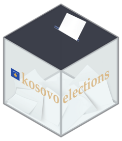

<!-- README.md is generated from README.Rmd. Please edit that file -->

# `kosovoelections` 

[](https://github.com/Kushtrimvisoka/kosovoelections)
[](https://github.com/Kushtrimvisoka/kosovoelections)
[](https://travis-ci.org/rstudio/rmarkdown)
[](https://cran.r-project.org/web/licenses/MIT)

An unofficial package with election results

### Installation

``` r
# install.packages("devtools")
devtools::install_github("Kushtrimvisoka/kosovoelections")
```

### Example

**Load {kosovoelections} package…**

``` r
library(kosovoelections)
```

**Download Election Results**

``` r
data <- get_election_results(type = "national", # "local" (for local assembly), or "mayor", or "mayor2" (for runoffs).
                             year = 2021,
                             by = "candidate", # or "party".
                             level = "national" # "municipality", or "pc" (Polling Center), or "ps" (Polling Station).
                             )
#> Downloading data for 2021 national assembly elections, by candidate, at national level...
```

``` r
summary(data)
#>    Party_ID            Party             Acronym           Candidate        
#>  Length:1052        Length:1052        Length:1052        Length:1052       
#>  Class :character   Class :character   Class :character   Class :character  
#>  Mode  :character   Mode  :character   Mode  :character   Mode  :character  
#>                                                                             
#>                                                                             
#>                                                                             
#>     Gender              Votes         
#>  Length:1052        Min.   :     2.0  
#>  Class :character   1st Qu.:   127.8  
#>  Mode  :character   Median :   528.0  
#>                     Mean   :  3515.8  
#>                     3rd Qu.:  3293.5  
#>                     Max.   :300756.0
```

**Plot a simple map**

``` r
# install.packages("devtools")
# devtools::install_github("Kushtrimvisoka/kosovomaps")
library(kosovoelections)
library(kosovomaps)
library(tidyverse)
library(sf)

map <- mapof(x = "municip")

data <- get_election_results(type = "national", # "local" (for local assembly), or "mayor", or "mayor2" (for runoffs).
                             year = 2021,
                             by = "candidate", # or "party".
                             level = "municipality" # "national", or "pc" (Polling Center), or "ps" (Polling Station).
                             )

data <- data %>% 
  filter(Candidate == "VJOSA OSMANI") %>% 
  group_by(id, Municipality, Candidate) %>% 
  summarise(Votes = sum(Votes))

data <- merge(map, data)

p <- ggplot(data = data)+
  geom_sf(aes(fill = Votes)) +
  scale_fill_viridis_c("Votes", direction = -1, option = "E") +
  labs(title = "Votes cast for Vjosa Osmani-Sadriu", 
       caption = "Source: CEC")+
  theme_void()
```

Plot example

``` r
print(p)
```


### Data

Source: Central Election Commission of Kosovo
(<https://www.kqz-ks.org>).

The data in this package are taken from the CEC website and processed in
R using various packages for processing Excel and PDF files.

Disclaimer: This package does not have any connection with the CEC or
other public institutions in Kosovo. I do not claim or guarantee the
accuracy of the data in this package. I disclaim any responsibility or
liability for errors and omissions.

For the official and certified election results, please refer to the CEC
website.

### Data availability

By level: national

| Type of elections    | 2021 | 2019 | 2017 | 2014 | 2013 | 2010 |
|:---------------------|:-----|:-----|:-----|:-----|:-----|:-----|
| National Assembly    | Yes  | Yes  | Yes  | Yes  | Yes  | No   |
| Local Assembly       | –    | –    | Yes  | –    | Yes  | –    |
| Mayor - First Round  | –    | –    | Yes  | –    | Yes  | –    |
| Mayor - Second Round | –    | –    | Yes  | –    | Yes  | –    |

By level: municipality

| Type of elections    | 2021 | 2019 | 2017 | 2014 | 2013 | 2010 |
|:---------------------|:-----|:-----|:-----|:-----|:-----|:-----|
| National Assembly    | Yes  | Yes  | Yes  | Yes  | Yes  | No   |
| Local Assembly       | –    | –    | Yes  | –    | Yes  | –    |
| Mayor - First Round  | –    | –    | Yes  | –    | Yes  | –    |
| Mayor - Second Round | –    | –    | Yes  | –    | Yes  | –    |

By level: polling center

| Type of elections    | 2021 | 2019 | 2017 | 2014 | 2013 | 2010 |
|:---------------------|:-----|:-----|:-----|:-----|:-----|:-----|
| National Assembly    | Yes  | Yes  | Yes  | Yes  | Yes  | No   |
| Local Assembly       | –    | –    | Yes  | –    | Yes  | –    |
| Mayor - First Round  | –    | –    | Yes  | –    | Yes  | –    |
| Mayor - Second Round | –    | –    | Yes  | –    | Yes  | –    |

By level: polling station

| Type of elections    | 2021 | 2019 | 2017 | 2014 | 2013 | 2010 |
|:---------------------|:-----|:-----|:-----|:-----|:-----|:-----|
| National Assembly    | Yes  | Yes  | Yes  | Yes  | Yes  | No   |
| Local Assembly       | –    | –    | Yes  | –    | Yes  | –    |
| Mayor - First Round  | –    | –    | Yes  | –    | Yes  | –    |
| Mayor - Second Round | –    | –    | Yes  | –    | Yes  | –    |

### Codebook

| Variable Name     | Description                         |
|-------------------|-------------------------------------|
| `id`              | Unique ID for each Municipality.    |
| `Municipality`    | Name of Municipality (in Albanian). |
| `Polling Center`  | Unique ID for each Polling Center.  |
| `Polling Station` | Unique ID for each Polling Station. |
| `Candidate`       | Name of candidate.                  |
| `Gender`          | Gender of the candidate.            |
| `Party_ID`        | Unique ID for each political party. |
| `Party`           | Full name of political party.       |
| `Acronym`         | Acronym of political party.         |
| `Votes`           | Number of votes.                    |

### License

This package is released under the MIT License. For more, see “License”.
